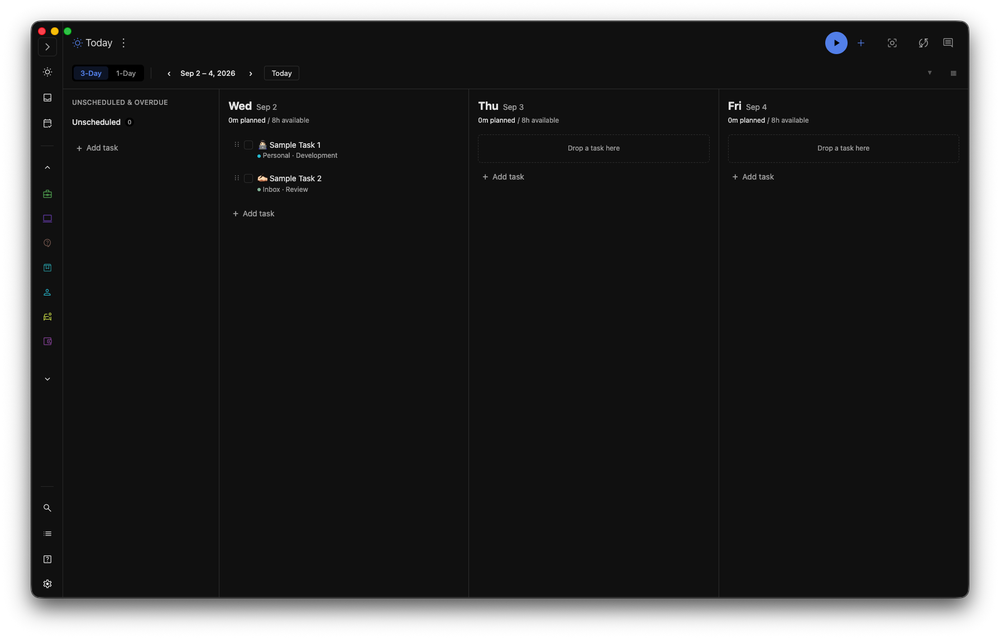

# Better Planner

[](LICENSE)
[](../../releases/latest)

A [Super Productivity](https://super-productivity.com/) plugin that adds a wide, multi-day
planning view — an alternative to the built-in Planner's narrow, infinitely-scrolling columns.



Better Planner adds its own nav tab with:

- **3-Day view** — today, tomorrow, and the day after side by side, so you can see and
  drag tasks across days at a glance.
- **1-Day view** — a single day, timeline-focused _(in progress — see [Status](#status)
  below)_.
- An **Unscheduled & Overdue rail** on the side, always visible, so nothing falls through
  the cracks.
- **Drag-and-drop** planning: drag a task between days to reschedule it, or drag it onto
  the rail to unplan it.

## Installation

1. Grab the latest `better-planner-vX.Y.Z.zip` from this repo's
   [Releases page](../../releases).
2. In Super Productivity, go to **Settings → Plugins** and upload the zip.
3. A new "Better Planner" tab appears in the side nav.

No build step needed — the release zip is ready to install as-is.

## Status

This plugin is under active development. The 3-Day view (including drag-and-drop) is
functional today. The 1-Day timeline view is not built yet and currently shows a
placeholder.

## Development

Requires Node.js 22+ (see `.nvmrc`).

```bash
npm install
npm run dev        # Vite dev server, for quick iteration on markup/styles
npm run build       # produces a self-contained dist/index.html
npm run package      # builds + zips dist/ into better-planner-vX.Y.Z.zip
```

Useful checks before committing:

```bash
npm run typecheck
npm run lint
npm run format
```

To have Vite copy each build straight into a local Super Productivity checkout for live
testing, set `SP_BUNDLED_PLUGINS_DIR` before running `npm run dev`/`build`, e.g.:

```bash
SP_BUNDLED_PLUGINS_DIR=../super-productivity/assets/bundled-plugins/better-planner npm run dev
```

## Releasing

Version bumps and changelog entries are managed automatically by
[Release Please](https://github.com/googleapis/release-please) based on
[Conventional Commit](https://www.conventionalcommits.org/) messages on `main`. It keeps a
release pull request up to date with the next version and changelog; merging that PR tags the
release and publishes a [GitHub Release](../../releases), which in turn triggers a workflow
that builds, packages, and uploads `better-planner-vX.Y.Z.zip` to that release.

## Contributing

This project isn't accepting code contributions (pull requests) right now, but bug reports and
feature requests are very welcome — please [open an issue](../../issues/new/choose). See
[CONTRIBUTING.md](CONTRIBUTING.md) for details, and [SECURITY.md](SECURITY.md) if you're
reporting a security issue.

## License

[MIT](LICENSE) © Yuyi Kimura
